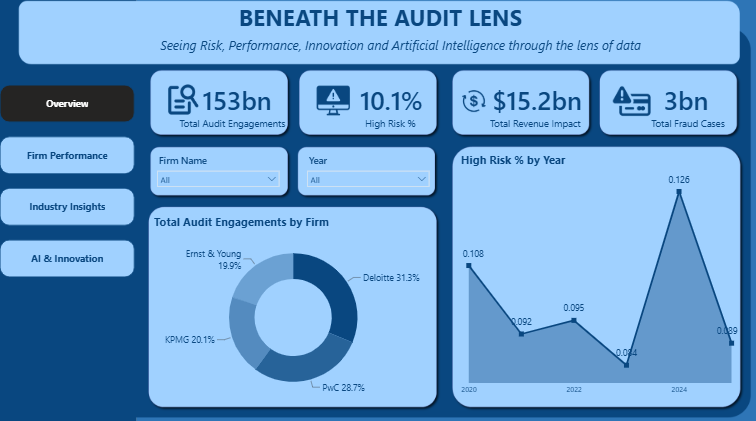
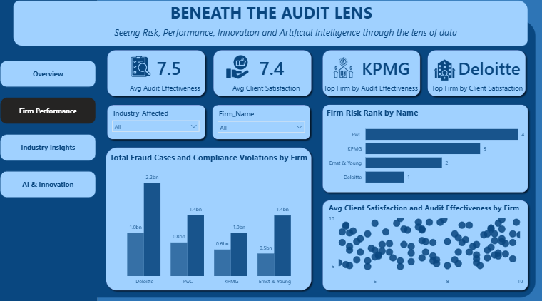
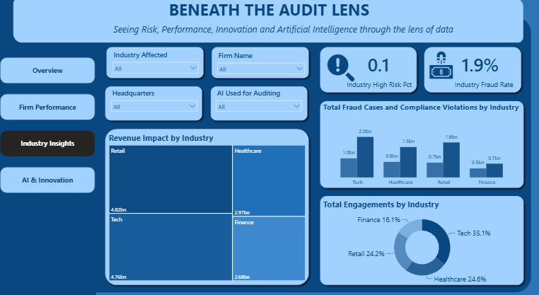
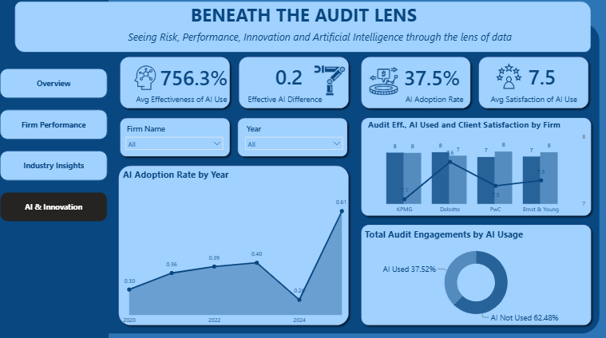

## Beneath the Audit Lens
### Seeing Risk, Performance, Innovation and Artificial Intelligence through the lens of data.

#### About the Project
"Beneath the Audit Lens" is an interactive Power BI dashboard designed to explore audit-related risk, firm performance, industry impact, fraud, compliance and artificial intelligence adoption.
The dashboard examines patterns across four major audit firms:
- Deloitte
- PwC
- KPMG
- Ernst & Young

It also compares activity across four industries:
- Finance
- Healthcare
- Retail
- Technology

The analysis covers the period 2020–2025. 
Rather than presenting individual figures in isolation, the dashboard brings different aspects of audit activity together to make it easier to identify patterns, differences and areas that may require further attention.

This collection of dashboard is an analytical and visualization project based on simulated practice data, and should not be interpreted as an official performance or risk assessment of the firms shown.

#### Project Objectives
The dashboard was created to explore four main questions:
1. How does audit activity and risk change over time?
2. How do the audit firms compare in performance and client satisfaction?
3. Which industries experience greater fraud, compliance and revenue impact?
4. How is AI adoption changing across the audit landscape?

#### Dashboard Preview
| Overview | Firm Performance |
|---|---|
|  |  |

| Industry Insights | AI & Innovation |
|---|---|
|  |  |

#### Dashboard Pages
##### 1. Overview
The Overview page provides a broad view of the audit landscape.
It includes:
- Total audit engagements
- High-risk percentage
- Revenue impact
- Fraud cases
- Audit engagements by firm
- High-risk trends across the years

The page is designed to answer the question:
What does the overall audit risk and activity landscape look like?

##### 2. Firm Performance
The Firm Performance page focuses on differences between the four audit firms.
It looks at:
- Average audit effectiveness
- Average client satisfaction
- Firm rankings
- Fraud cases
- Compliance violations
- Relationship between client satisfaction and audit effectiveness

The page makes it easier to compare firms and identify where performance measures differ.

##### 3. Industry Insights
The Industry Insights page shifts the focus from individual firms to the industries being audited.
It explores:
- Revenue impact by industry
- Fraud and compliance cases by industry
- Audit engagement distribution across industries
- Industry-level risk indicators

This allows users to seek answers to the question:
Which industries appear to experience greater audit-related impact or risk?

##### 4. AI & Innovation
The AI & Innovation page explores the use of artificial intelligence in auditing.
It includes:
- AI adoption over time
- AI usage across audit engagements
- Audit effectiveness
- Client satisfaction
- Comparisons between firms
- AI-related audit performance indicators

The purpose is to explore whether changes in AI adoption appear alongside differences in audit outcomes.

#### Key Insights
The dashboard allows users to interactively explore several interesting patterns.
##### a. Firm Distribution
The Overview page shows that Deloitte and PwC account for the largest shares of total audit engagements, followed by KPMG and Ernst & Young.

##### b. Risk Over Time
High-risk activity varies across the years rather than following a constant pattern, with noticeable changes in particular years.

##### c. Industry Impact
The Industry Insights page shows that Technology and Retail have the largest revenue-impact values in the dataset, while Healthcare and Finance also contribute substantial amounts.

##### d. AI Adoption
AI adoption changes considerably across the period covered by the dashboard, with the highest observed adoption occurring toward the end of the period.

These observations are intended as starting points for exploration rather than definitive conclusions about the real-world firms or industries.

#### Tools Used:
Microsoft Power BI - Dashboard development and visualization 
Power Query - Data preparation and transformation 
DAX - Calculations and dashboard measures 
Excel - Dataset wrangling 

#### Visualizations:
The dashboard uses a combination of:
- KPI cards
- Line charts
- Bar charts
- Donut charts
- Treemaps
- Scatter plots
- Interactive slicers
- Page navigation buttons

#### Interactive Features:
The dashboard is designed to be explored rather than simply viewed.
So users can:
##### i. Filter the Analysis
Use the available slicers to filter by factors such as:
- Firm
- Year
- Industry
- Headquarters
- AI usage

##### ii. Compare Firms
Select a firm in the visuals or slicers to examine how its results compare with the other firms.

##### iii. Explore Trends
Use the year-based charts to observe how risk and AI adoption change over time.

##### iv. Cross-Filter Visuals
Selecting an element in one visual can affect the other visuals on the page, allowing for investigation of relationships within the data.

##### v. View Exact Values
Hover over charts and data points to see the underlying values.

#### Live Dashboard
No installation is required to explore the published report.
#### [Open Beneath the Audit Lens](https://app.powerbi.com/view?r=eyJrIjoiN2IyMDA1YTctYzMwMi00M2YwLWI3NDAtMjUyZjY2M2FkNjI0IiwidCI6IjEwNGQ4MDQ4LWZkMGMtNDNkNS1hNjMwLWZjNjI5ZTVkYWI1OSJ9)

For the best experience, open the dashboard on a desktop or laptop and use Power BI's full-screen option.

#### Dataset
The dashboard is based on an audit-related dataset retrieved from Kaggle, containing information covering:
- Audit firms
- Industries
- Audit engagements
- High-risk cases
- Fraud cases
- Compliance violations
- Revenue impact
- AI usage
- Audit effectiveness
- Client satisfaction
- Year

The data is used for educational and analytical visualization purposes.

#### Why This Dashboard?
Audit data can contain many different dimensions of information, making it difficult to identify meaningful patterns from tables alone.
"Beneath the Audit Lens" brings these dimensions together into a single interactive report so users can move from:
Overall Picture → Firm Performance → Industry Impact → AI Adoption
This structure allows the dashboard to tell a broader story about how risk, performance and technology intersect within auditing.

#### Project Structure
```text
audit-powerbi-dashboard/
│
├── Audit_dashboard.Report/
├── Audit_dashboard.SemanticModel/
├── images/
│   ├── overview.png
│   ├── firm-performance.png
│   ├── industry-insights.png
│   └── ai-innovation.png
│
├── .gitignore
├── Audit_dashboard.pbip
└── README.md
```

#### Author:
** Naa Akweley Marley **
Linkedin: [Naa Akweley Marley](https://www.linkedin.com/in/naa-akweley-marley) 